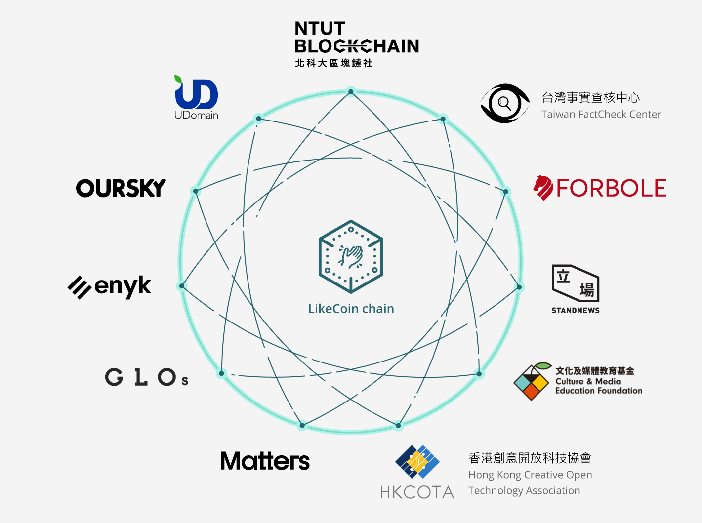
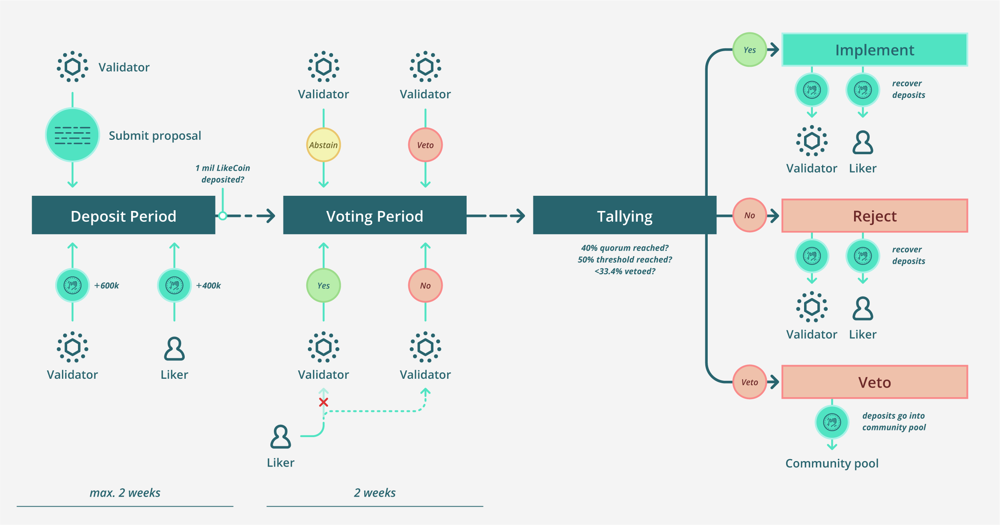

# 讚賞公民

1952年建立的[歐洲煤鋼共同體](https://zh.wikipedia.org/wiki/%E6%AC%A7%E6%B4%B2%E7%85%A4%E9%92%A2%E5%85%B1%E5%90%8C%E4%BD%93)，當時只有六個成員國。1958年又成立[歐洲經濟共同體](https://zh.wikipedia.org/wiki/%E6%AD%90%E6%B4%B2%E7%B6%93%E6%BF%9F%E5%85%B1%E5%90%8C%E9%AB%94)和[歐洲原子能共同體](https://zh.wikipedia.org/wiki/%E6%AD%90%E6%B4%B2%E5%8E%9F%E5%AD%90%E8%83%BD%E5%85%B1%E5%90%8C%E9%AB%94)，1967年統合在[歐洲各共同體](https://zh.wikipedia.org/wiki/%E6%AC%A7%E6%B4%B2%E5%90%84%E5%85%B1%E5%90%8C%E4%BD%93)之下，1993年《[馬城條約](https://zh.wikipedia.org/wiki/%E9%A9%AC%E6%96%AF%E7%89%B9%E9%87%8C%E8%B5%AB%E7%89%B9%E6%9D%A1%E7%BA%A6)》生效後轉變成歐盟，並且漸漸地從貿易實體轉變成經濟和政治聯盟。同時，歐洲經濟共同體和後來的歐盟在1973年至2013年期間八度擴大，成員國從6個增至最多時有28個。。[歐元](https://zh.wikipedia.org/wiki/%E6%AD%90%E5%85%83)由27個成員國中的19個採納為流通貨幣。

歐盟設有成員國首腦組成的歐洲理事會、直接民選的歐洲議會等組織，制定各項政策與法律，比如數碼單一市場版權法案（Directive on Copyright in the Digital Single Market）、一般資料保護規範（General Data Protection Regulation，GDPR）等，再由成員國在國內立法具體執行。

各國既能保有主權、母語和文化，和平共處，又能有體現共同體意志，使用單一貨幣促進貿易與加強實力，是人類歷史上的重要的里程碑。2012 年，歐盟獲頒諾貝爾和平獎。

### 公民媒體共同體

物理世界有距離，有疆界，歐洲各國經歷兩次世界大戰，尚且能夠成立聯盟，貫穿各國的，是幾千年的文化底蘊與共同命運。借鑒歐盟，定位公民媒體共同體的讚賞公民共和國，Republic of Liker Land，於 2019 年 11 月 15 日正式在區塊鏈成立。

截至 2020 年 5 月，讚賞公民共和國共有 1000 多個成員媒體，正如歐盟成員國，成員媒體保有主權、品牌、網站、編採方針和其他自由，只求在基礎議題上謀求共識，未來議題包括定奪與處理假信息、應對內容農場、回饋好內容等等。共和國的「貨幣」為讚賞幣 LikeCoin 通證，但有別與歐元，各成員媒體完全有自由使用各種貨幣，而 LikeCoin 是共同體價值的載體。

除了 1000 多媒體成員，共和國現有公民 7 萬多，其中約 2.5% 為「讚賞公民」，每月為共同體貢獻 5 美元，化讚為賞，回饋創作，相當與共和國的繳稅人口。公民中約 14% 即 1 萬多為作者，所創作的其中 24 萬多筆內容，一般為文章，得到回饋共 3 千多萬 LikeCoin。

讚賞公民共和國成立之初，由 10 個組織組成 7 個單位充當驗證人，分別為台灣事實查核中心、國立臺北科技大學區塊鏈社、文化及媒體教育基金、香港創意開放科技協會、立場新聞、Matters、GLOs、Forbole、Oursky、Enyk 及 UDomain。驗證人的角色接近歐洲議會，但除了治理，同時擔當底層 LikeCoin 區塊鏈的節點，因此有些媒體跟技術提供方搭配成一單位，擔當驗證人。

### LikeCoin 區塊鏈

技術上，讚賞公民共和國以 LikeCoin 區塊鏈實現，其為公共鏈，任何人無須獲得批准均可加入（permissionless），或者說，沒有人有權批准或否決媒體的加入。LikeCoin 區塊鏈使用的共識機制稱為綁定權益證明（Bonded Proof of Stake），有持分者把手上 LikeCoin 委託與驗證人，再由驗證人按相等於獲委託數量的投票權，確認每 5 秒鐘一個區塊的交易。

Alice 給 Bob 轉帳 100 LikeCoin，傳統的金融體系，記帳的是銀行，簡單的情況是同一家，複雜一點的是香港分別的兩家，更複雜的是分別處於兩國，相互有記帳合作的兩家，甚至更複雜的沒有記帳合作的兩家銀行。在 LikeCoin 區塊鏈中，Alice 以密碼學簽名發出 100 LikeCoin 後，廣播通知所有驗證人交易內容，每 5 秒鐘驗證人把期間的所有交易打包成一個區塊，再由各驗證人以密碼學簽名作實，無論 Bob 身在何方，約 5 秒後會收到 100 LikeCoin。

每簽名確認一區塊，驗證人會按獲委託數得到新鑄造的 LikeCoin，換言之，這些 LikeCoin 的來源是通證膨脹，作用是反映驗證人貢獻的價值，LikeCoin 的通脹率為每年 1%，即每年新鑄造相當於 1% 總 LikeCoin 數的通證，用以回饋驗證人。由於驗證人的投票權來自持分者委託，因此回饋由兩者按 40-60% 不等分成。

每個區塊的確認，需要 2/3 以上持分簽名作實通過，實現拜占庭容錯機制，確保整個共同體由始至終保持共識。假設有驗證人作假修改區塊內容，不但會因為得不到 2/3 以上持分確認沒法通過，還會被處罰委託的 LikeCoin，以博弈理論防止作弊。因此，把 LikeCoin 委託與驗證人賺取回報，雖然感覺表面上存款到銀行收取利息類似，但實際上前者是持分者貢獻資源，每個區塊所獲取的 LikeCoin 幫助社群維持共識的補償，並非利息。習慣類比比特幣的，把這個機制理解為持分挖礦，也沒不可。

以上 1% 通脹率、40-60% 傭金等比率都是現有的數字，可以由驗證人通過提案去增減，跟議會通過財政預算案差不多。除了經濟，媒體相關的議題如事實查核，以至軟件升級等技術決策，都可以而且需要由驗證人通過議案方可執行，這些由代碼寫成的規則，就是讚賞公民共和國的憲法；驗證人通過議案修改各項規則，就是修憲。

### 共和國治理

讚賞公民共和國的修憲流程，由 LikeCoin 區塊鏈的代碼記錄與執行。每個驗證人均可隨時提出議案，提出後，議案進入抵押期，期間提案驗證人宣傳和集氣，務求於兩周內讓議案從持分者手中獲得一百萬 LikeCoin 抵押以進入投票期。抵押制度類似集到十萬聯署人則議案付諸公投，抵押的 LikeCoin 則像選舉保證金，避免有人隨意提出議案，勞師動眾。

投票期為兩周，期內驗證人就議案投贊成、反對、棄權，以及比較特別的強烈反對票（veto），同一時間，持分者也可以於投票期內轉換驗證人一次。投票期結束，無論是贊成票多還是反對票多，一百萬抵押都會發還，然而，加入超過 1/3 持分投出強烈反對，表達提案為惡意，則不但即使贊成過半議案都不獲通過，抵押也將不獲發還，存於社區基金，由後續的議案調度。

議案技術上可分三種，一是系統改版議案（upgrade proposal），用於驗證人節點軟件更新，二是參數修改議案（parameter change proposal），比如把通脹率從 1% 調高到 2%，不同於物理世界，這兩類議案通過即執行，不存在懸念。第三種是訊號議案（signaling proposal），為一種立場指引，可為共同體提供發展方向，但也牽涉執行者的進一步演繹和落實，甚至沒法落實，情況類似英國脫歐，即使公投結果確認，但細節久久沒法落實，甚至最終成事前一度懷疑會否爛尾。而最終成功執行，也是再一次展示了歐盟的讓成員決定自身未來的文明，跟帝國霸權不可同日而語。

### 流動民主

這種治理方式，是流動民主的一種演繹。先撇開讚賞公民共和國語境，流動民主本是代議政制的加強版，從幾方面賦予人民更深入的參與：一、可委託一個或以上代表，也可分不同程度；二、可於不同時間，就不同議題，委託不同的代表；三、可選擇自行就議案直接投票。

對代議政制期盼了幾十年的我們，很容易變得「夏蟲不可語冰」，難以想像更進一步的流動民主，具體如何運作。且想像在理想國，相對於一人一票，每位選民獲分配 100 點「話語權」（voice credits）。理想國居民 Alice 認可 Bob 的政見、能力與誠信，於是把 100 點話語權全數委託給 Bob。豈料，理想國政府提出議案，出賣人民，Bob 竟然投下贊成票。不幸中之大幸是，Alice 不用等待四年後以選票懲罰 Bob，而是馬上把話語權轉走，這次分散信任，分別給 Carol 與 Dave 委託 60 點和 40 點話語權。出賣人民的 Bob，由於大量話語權被轉走，即時失去議員資格。

過了一陣子，理想國表決教育改革議案，Alice 認為教師出身的 Carol 比律師 Dave 對此更有心得，遂把 Dave 的 40 點話語權都委託給 Carol，對議案投出最有力一票。又過了一陣子，理想國討論反資訊科技滲透議案，屬 Alice 的專業範疇，於是 Alice 收回 100 點話語權自用，直接對議案作出表決。話語權點數像水一般流動，讓理想國人靈活地在不同時間，就不同議題，委託不同代表議決或自行表決；至於議員，則需時時刻刻聆聽人民訴求，確保自己持續反映委託者的權益。

讚賞公民共和國對流動民主的實踐，跟理想國略有區別，暫時不允許個人投票的直接民主，不過由於個人可在投票期把持分轉給跟自己取向一致的驗證人，因此跟直接民主分別不大。真正顯著的差異在於，共和國以日常使用的通證 LikeCoin，同時用作話語權點數，而非使用最廣為接受的一人一票。

去中心自治組織雖然在很多方面是物理國家在數位世界的投射，但也有根本的不一樣，其中一個最大的區別是公民身份的落實。物理世界中，每個人生而成為某國人，除了小部分移民移居，或者持有多國護照的，一個人就是其居住地的公民，儘管某些國家沒有公民權利的概念。但對於開放的去中心自治組織，個人是依據理念和興趣，不受束縛地隨時加入和退出若干組織，也可以在同意組織開立眾多身份。因此，在去中心自治組織衡量一個身份的公民權利需要用其他方法，而在讚賞公民共和國，這個方法就是所持有的 LikeCoin，因為作為公民媒體共同體，共和國的核心價值是報導與創作，作品所賺取的 LikeCoin，反映創作者的貢獻度，也同時反映這個身份在共和國裡的公民權利。

讚賞公民共和國成立只有半年多，尚在初步發展當中，審議並通過了一個議案，把驗證人的數量從 7 個提高到 10 個，踏出了議政的第一步。共和國嘗試跳離物理世界的框架，讓公民媒體共同體在數位空間發酵，實踐民主共治，是個愚公移山似的社會實驗，單是讓大眾理解和應用就得十年，最終可以走得多遠，為人類社會帶來甚麼啟發，有賴公民的努力。

* Big Dipper: open government
* LikeCoin chain: consensus、open data
* 擁抱一套共同價值的就是 xx 人
* DAO、MakerDAO、Aragon、HKG

